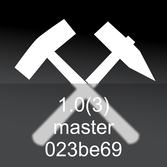
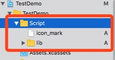
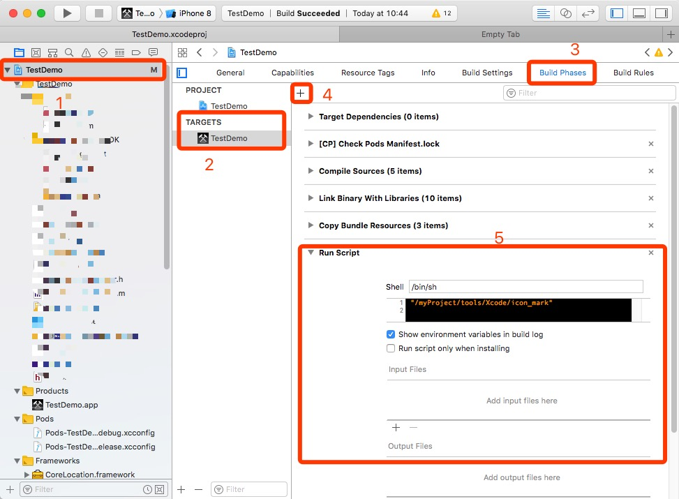
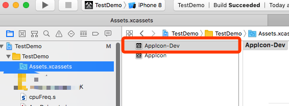
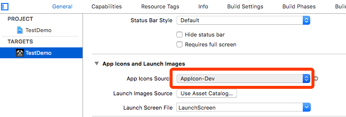

# Xcode Script Tools

## AppInfo Icon Maker

Shell Script tool of Xcode.

Make App Dev-Info more clearer and straight.
Info: 

- __Git-Info__ (e.g. ver-hash,branch)
- Xcode __Project-Info__ (e.g. short-version,build-number)
 
Add text of above info to the App-Icon image as a watermark.




### Featrue 

- [x] Add infomation(git,project..) to App-Icon image.
- [x] Make a new 'AppIcon-Dev.appiconset' directory. You can select.

### Requirement

_test passed_

- MacOSX 10.x+ 
- Xcode 9+
- [ImageMagick](http://www.imagemagick.org/)

### Dependent On

#### Install

If you not install `brew`, flow step below to install(or ignore):

__[Homebrew](https://brew.sh/)__

```shell 
/usr/bin/ruby -e "$(curl -fsSL https://raw.githubusercontent.com/Homebrew/install/master/install)"
```

---

__[ImageMagick](http://www.imagemagick.org/)__ 

```shell
brew install imagemagick 
```

### Auto INSTALL (Configure '.xcodeproj' automatic)

Copy `install` script file to your project __folder__ as same as `.xcodeproj` directory, and run:

```shell
./install
```

If nothing goes wrong. and you are ready to go.
try <kbd>command</kbd> + <kbd>B</kbd> build project in Xcode.

_NOTE:Markup app icon only when CONFIGURATION=Debug_

__To unconfigure your project.__

```shell 
./install . noclean
./appicon_mark.rb uninstall --project <PATH_TO_YOUR_PROJECT>/<PROJECT_NAME>.xcodeproj
```

__To remove all cache files.__

```
./install clean
```


---

### Usage (Manual)

#### 0x0 Import to project (Recommend)

Add tool to your project

__0x00:__

Add __2 files__ to the project(with copy).

- icon_mark
- lib/dev_kit.sh

BE-SURE: `icon_mark`, `lib` directory, in the same level.



__0x01:__

Edit `Run Script` content:

```shell
"<Path-To-Script>/icon_mark"
```


In this demo project use : `"${PROJECT_DIR}/${PROJECT_NAME}/Script/icon_mark`

__0x02:__

If `Build Phases` -> `Copy Bundle Resources` has the script files(`icon_mark`,`lib/dev_kit.sh`), and remove them.


---

#### 0x0 Import global environment (Another usage)

__0x00:__

Put the script whatever you want.

```
.
├── icon_mark
└── lib
    └── dev_kit.sh
```

__0x01:__

Open Xcode Project.

`Xcode Project` -> `Target` -> `Build Phases` -> `Add 'Run Script'` -> `Edit to run script file`



__Note:__ Script path(Absolute path recommend) : `<Dir-Path-To>/icon_mark`

Please make sure that the `lib` directory should be in the same directory as `icon_mark` file.

---

#### 0x1 Run And Setup.

1. First `Build` your project; if success, `AppIcon-Dev` was generated in the `.xcassets` folder.
2.  Set project -> target -> General -> App Icons and Launch Images -> App Icons Source to `AppIcon-Dev` 
3. `Run` again. the AppIcon will be setup.





__!Important__ 

- Make sure your project has the `.appiconset` folder which has a `size:1024x1024` of App icon image in it.
- The marked app icon only created in `Debug` CONFIGURATION.
- Only support One `.xcassets` Directory (Random selected) of project.


### Reference

- [iconVersion](https://github.com/krzysztofzablocki/IconOverlaying/blob/master/Scripts/iconVersioning.sh)

### LICENSE

__MIT__


## Related tools

- [App Icon Fitter](https://github.com/poplax/app-icon-fitter)
- [AppInfo Icon Marker](https://github.com/poplax/app-icon-fitter/blob/master/tools/Xcode)